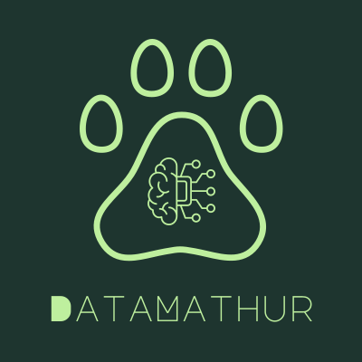

  

# Introducing DataMathur 🍵

Hi there 👋! I am **[Utkarsh Mathur](https://datamathur.github.io/)**, ***a.k.a. DataMathur***, a 24-year-old new-grad with **MS in Data Science** from University at Buffalo, **B.Tech. from IIT Roorkee**, and **2 years of experience** in Data Science, Software Engineering, and Data Engineering. I am currently working as a **Data Scientist at Atriano**, developing an educational story generation web app for kids using ***Large Language Models (LLMs)*** and ***recommendation algorithms***.

I am passionate about leveraging my skills to develop scalable AI/ML software and services as well as picking up new skills on the way. My expertise spans **programming** (Python, C++, SQL, R, Perl, and JavaScript), **machine learning**, **data engineering**, and **software development**.

I am committed to continuous learning and passionate about creating impactful and practical solutions. I believe that with dedication, hard work, and a positive mindset, anything is achievable - a principle I've demonstrated throughout my academic and professional career.

## [Education](https://datamathur.github.io/#edu) 🎓

**University at Buffalo, State University of New York** 
***Master of Science in Data Science*** 
*January 2023 – June 2024*
  
**Indian Institute of Technology Roorkee (IIT Roorkee)** 
***Bachelor of Technology in Polymer Science (Chemical Engineering)*** 
*July 2018 – July 2022*

## [Work Experience](https://datamathur.github.io/#work) 💼

1. **Machine Learning Engineer at Atriano** (September 2024 - *Present*)
2. **Machine Learning Engineer, Imaging at ImagoAI** (October 2024 - January 2025)
3. **Data Scientist at Quinbay** (May 2022 - October 2022)
4. **Machine Learning Engineer at Hono** (July 2021 - April 2022)
5. **Research Intern under Dr. Mayank Goswami** (September 2020 - June 2021)
6. **Data Scientist at ImagoAI** (April 2021 - May 2021)
7. **Research Intern under Dr. Kusum Deep** (September 2021 - December 2021)
8. **Research Intern under Dr. Gaurav Manik** (July 2019)

## [Key Skills and Expertise](https://datamathur.github.io/#about) 💻
1. **Python Programming**: Develop end-to-end solutions for *Machine Learning*, *Model Deployment*, and *Process Automations* using Python.

2. **Machine Learning**: Develop and deploy ML solutions for *Computer Vision*, *NLP*, *Regression*, *Classification*, and *Recommendation Systems* using *sklearn*, *PyTorch*, *TensorFlow*, *Keras*, and *XGBoost*.

3. **MLOps**: Deploy ML solutions on *cloud* (AWS, GCP) using *ETL/ELT pipelines*, *MLOps*, *CI/CD pipelines*, and *Model Monitoring Tools*.

4. **Data Analysis**: Performing data analysis with *PowerBI*, *Tableau*, *Python*, *SQL*, and *R* to extract actionable insights

5. **ETL/ELT Pipelines**: Developing ETL pipelines for big data using *AWS*, *SQL*, *Snowflake*, and *Databricks*.

6. **Software Developmemt**: Fullstack deployment of developed solutions using *Python*, *JavaScript (Node, Angular, React, MongoDB, Django)*, *C++*, and *HTML/CSS*.

7. **Gen AI**: *Fine-tuning* GenAI foundation models (*LoRA, QLoRA*), *RAG* with *Knowledge Graphs* and *Vector Database* augmentation for *Agentic AI*.

## [Key Projects](https://datamathur.github.io/#projects) 📝

1. **Graph Neural Networks and Large Language Models**: A Literature Review (Capstone Project - University at Buffalo)
2. **Metaheuristic Optimization v/s Backpropagation** (Course Project - University at Buffalo)
3. **Top Spotify Tracks Database** (Course Project - University at Buffalo)
4. **Statistical Analysis** (Course Project - University at Buffalo)
5. **Clustering and Time Series Analysis** (Course Project - University at Buffalo)

## [Contact Me](https://datamathur.github.io/#contact) ✉️

Feel free reach out at [utkarsh.mathur@gmail.com](mailto:utkarsh.mathur@gmail.com) and [datamathur@outlook.com](mailto:datamathur@outlook.com) to explore potential opportunities and collaborations.

For more information regarding means to contact me, please visit the [contact page](https://datamathur.github.io/#contact).

[Schedule a virtual call with me](https://calendly.com/datamathur/discussion_with_utkarsh_mathur)

<!--
**datamathur/datamathur** is a ✨ _special_ ✨ repository because its `README.md` (this file) appears on your GitHub profile.

Here are some ideas to get you started:

- 🔭 I’m currently working on ...
- 🌱 I’m currently learning ...
- 👯 I’m looking to collaborate on ...
- 🤔 I’m looking for help with ...
- 💬 Ask me about ...
- 📫 How to reach me: ...
- 😄 Pronouns: ...
- ⚡ Fun fact: ...
-->

